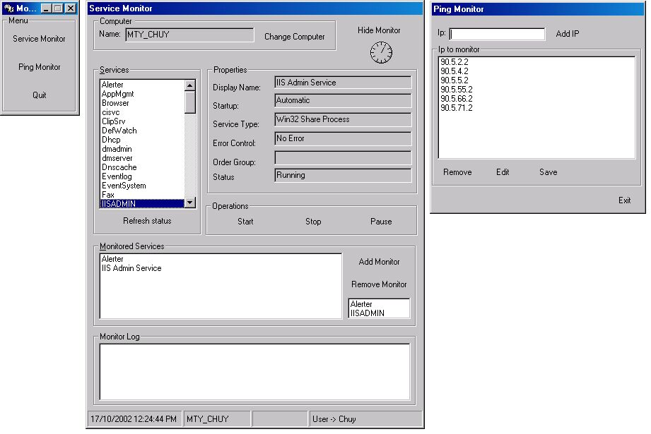



## Service and Ping monitor

### Description

Hi programers!!

This code I think is one of the best for monitoring IP addresses and services (I have never seen this)

It can monitor any number of IP address in variable intervals of time, it let you know when an IP fails the number of times you especified in an INI file, it send messages to you or the people you want, just tyoe the computers name in the INI file.

The service monitor feature, it monitors any services on NT/2000 servers, an if one of the service monitored is down it traies to start it again, and of course, it also let you know what is happening.

Pleas take a look to de code a let me know your comments, and please vote for it!!!

I MUST thanks to the people to help develop this program, because with out their help ti couldn't be possible.

THANKS A LOT GUY!!!
 
### More Info
 
The input th program needs are it two files Services.ini and IpAddress.txt. In the first file you type the computers you want to advice when something gets wrong, and in the second one are save all the IP address monitored

To monitor services this program must be run on a NT/2000(professional or server) machine and you must have administrative account.

As I have explained, te progeam advice via NET SEND with messagess to the computers you typed in the INI file with information that what is going wrong, such and IP addres failed or service down and restarted.

             |
---                |---
**Submitted On**   |2002-10-17 12:21:10
**By**             |[Jesus Garcia](https://github.com/Planet-Source-Code/PSCIndex/blob/master/ByAuthor/jesus-garcia.md)
**Level**          |Advanced
**User Rating**    |4.6 (23 globes from 5 users)
**Compatibility**  |VB 6\.0
**Category**       |[Windows API Call/ Explanation](https://github.com/Planet-Source-Code/PSCIndex/blob/master/ByCategory/windows-api-call-explanation__1-39.md)
**World**          |[Visual Basic](https://github.com/Planet-Source-Code/PSCIndex/blob/master/ByWorld/visual-basic.md)
**Archive File**   |[Service\_an14871510252002\.zip](https://github.com/Planet-Source-Code/jesus-garcia-service-and-ping-monitor__1-40156/archive/master.zip)

### API Declarations

There are a lot of API's I recommend you to look at the code

